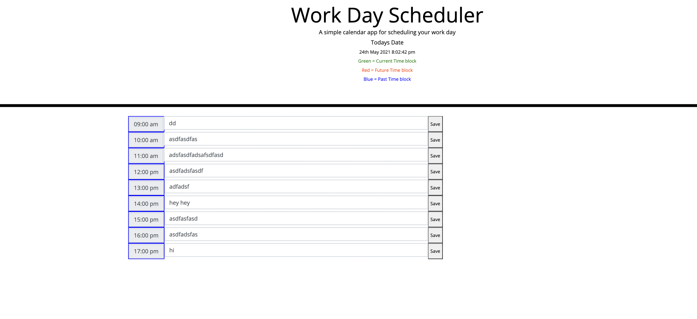

# assignment-5

This is an app used as a  daily planner to create a schedule the current day is displayed at the top of the calendar and user is presented with timeblocks for standard business hours. Each timeblock is color coded to indicate whether it is in the past, present, or future. When user clicks into a timeblock they can enter an event and then save it in local storage.

